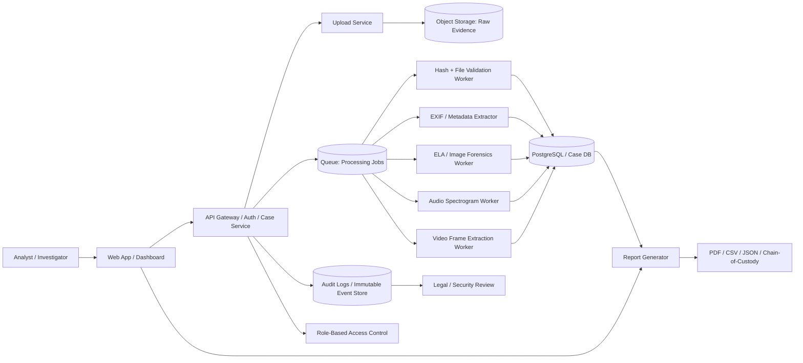
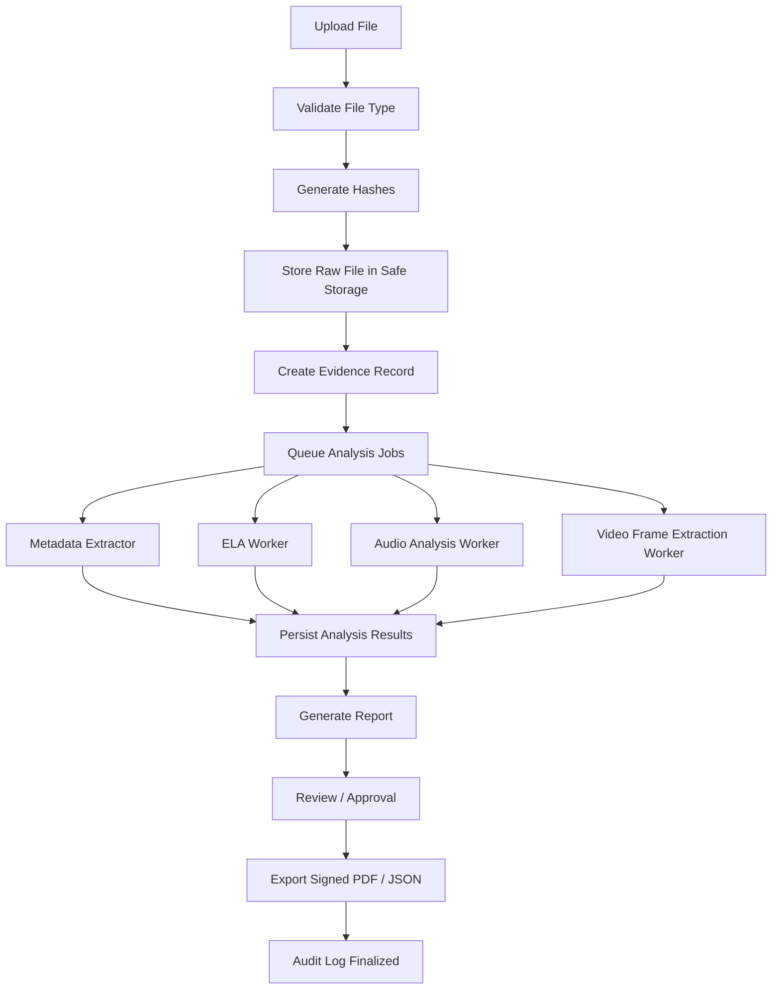
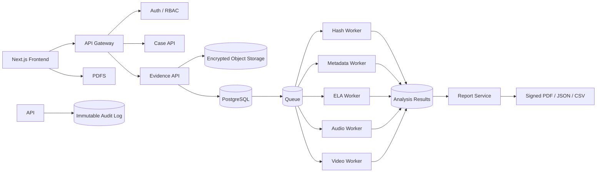

# Media Forensics Studio Pro

## Operational Product Blueprint

This file contains the full architecture and product plan for turning the current HTML demo into an operational digital evidence platform.

It is intentionally kept in a single file so you can use it directly as a project blueprint without needing to split it into multiple documents.

---

## 1. Product Vision

Media Forensics Studio Pro is a secure, auditable digital evidence platform for analyzing media files such as images, audio, and video. The system should support:

- secure evidence intake
- file integrity verification
- forensic metadata extraction
- visual analysis (ELA, spectrum, frame inspection)
- report generation
- chain-of-custody tracking
- role-based access control
- enterprise-grade logging and auditability

---

## 2. High-Level Architecture Overview



---

## 3. System Design Principles

### 3.1 Browser-first UI, backend-owned processing
The current prototype does too much inside the browser. For a real product, the browser should primarily:

- upload files
- show dashboards
- display analysis results
- allow analyst review and export

The backend must own:

- file validation
- hash generation
- EXIF parsing
- ELA processing
- spectrogram generation
- video frame extraction
- report creation
- audit log capture

### 3.2 Evidence trust and integrity
Every artifact must be traceable. The system should prove:

- the original file was uploaded without modification
- hashes were generated at ingestion
- every processing step is logged
- reports are reproducible
- each analyst action is recorded

### 3.3 Human workflow matters
This is not just a visual analyzer. It must behave like a case investigation workflow with:

- evidence intake
- case assignment
- analyst notes
- investigation status
- final report review
- export and archival

---

## 4. Recommended Product Stack

### Frontend
- Next.js
- React
- TypeScript
- Tailwind CSS
- React Query / Zustand

### Backend API
- NestJS or FastAPI
- REST + WebSocket support for live job updates
- JWT or enterprise SSO integration

### Database
- PostgreSQL
- Prisma or SQLAlchemy ORM
- immutable audit tables

### Storage
- S3-compatible object storage
- encrypted bucket storage
- versioned artifacts

### Processing Workers
- BullMQ / Celery / RabbitMQ
- Node.js or Python workers
- queue-based processing for large files

### Reporting
- PDF generation service
- HTML-to-PDF engine
- signed report packaging

### Security / Identity
- Keycloak / Auth0 / Azure AD / Okta
- MFA
- RBAC
- encrypted secrets

### Observability
- OpenTelemetry
- Prometheus
- Grafana
- centralized structured logging

---

## 5. Core Product Modules

### 5.1 Authentication & Authorization
Responsibilities:

- login / SSO
- MFA
- session management
- roles: analyst, reviewer, admin, auditor
- per-case access control
- secure API tokens

### 5.2 Case Management
Responsibilities:

- create case
- assign investigators
- track evidence list
- record chain-of-custody
- attach notes and comments
- mark case statuses

### 5.3 Evidence Intake
Responsibilities:

- drag-and-drop upload
- file type validation
- file size validation
- MIME checks
- quarantine suspicious files
- generate raw evidence record

### 5.4 Forensic Analysis Pipeline
Responsibilities:

- hash generation (MD5 / SHA256)
- EXIF extraction
- metadata normalization
- ELA analysis
- audio spectrum analysis
- video frame extraction
- result persistence
- quality score generation

### 5.5 Reporting Engine
Responsibilities:

- compile findings into structured report
- generate legal-ready summary
- include hashes, metadata, visual evidence, notes
- export as PDF / CSV / JSON
- archive signed outputs

### 5.6 Audit & Compliance
Responsibilities:

- log each user action
- keep immutable history
- chain-of-custody details
- retention policy enforcement
- export authorization
- review workflow approval

---

## 6. Recommended Data Model

### 6.1 Primary entities

- User
- Organization
- Case
- EvidenceItem
- HashRecord
- AnalysisJob
- AnalysisResult
- Report
- AuditEvent
- AccessLog
- Permission

### 6.2 Example structure

```sql
CREATE TABLE users (
  id UUID PRIMARY KEY,
  email TEXT UNIQUE NOT NULL,
  full_name TEXT NOT NULL,
  role TEXT NOT NULL,
  created_at TIMESTAMP NOT NULL
);

CREATE TABLE cases (
  id UUID PRIMARY KEY,
  title TEXT NOT NULL,
  description TEXT,
  created_by UUID REFERENCES users(id),
  status TEXT NOT NULL,
  created_at TIMESTAMP NOT NULL
);

CREATE TABLE evidence_items (
  id UUID PRIMARY KEY,
  case_id UUID REFERENCES cases(id),
  original_name TEXT NOT NULL,
  mime_type TEXT NOT NULL,
  size_bytes BIGINT NOT NULL,
  sha256 TEXT NOT NULL,
  md5 TEXT NOT NULL,
  storage_path TEXT NOT NULL,
  uploaded_by UUID REFERENCES users(id),
  uploaded_at TIMESTAMP NOT NULL,
  status TEXT NOT NULL
);

CREATE TABLE analysis_jobs (
  id UUID PRIMARY KEY,
  evidence_id UUID REFERENCES evidence_items(id),
  job_type TEXT NOT NULL,
  status TEXT NOT NULL,
  triggered_by UUID REFERENCES users(id),
  created_at TIMESTAMP NOT NULL,
  completed_at TIMESTAMP
);

CREATE TABLE audit_events (
  id UUID PRIMARY KEY,
  user_id UUID REFERENCES users(id),
  entity_type TEXT NOT NULL,
  entity_id TEXT NOT NULL,
  event_type TEXT NOT NULL,
  metadata JSONB,
  created_at TIMESTAMP NOT NULL
);
```

---

## 7. Core Processing Flow



---

## 8. Operational Requirements

### 8.1 Security and compliance
The product must include:

- encryption at rest
- encrypted transit
- access logs
- retention policy
- role-based authorization
- legal reporting controls
- evidence integrity checks
- signed export packs

### 8.2 Reliability and observability
The system should provide:

- health checks
- job retries and dead-letter queues
- centralized logs
- background job monitoring
- processing latency tracking
- alerting for failed jobs

### 8.3 User experience
The app should support:

- drag-and-drop uploads
- progress indicators
- status badges
- file queue management
- analyst notes
- reusable report templates

---

## 9. Product Features to Add

### Must-have features
- evidence upload and file validation
- MD5 and SHA256 generation
- EXIF and metadata extraction
- image ELA analysis
- audio spectrogram analysis
- video frame extraction
- case metadata dashboard
- report generation
- audit log tracking
- export to PDF/CSV

### Nice-to-have features
- deepfake detection hooks
- OCR for embedded text
- timeline reconstruction
- AI-assisted anomaly detection
- comparison against known evidence sets
- multi-agency collaboration
- report digital signatures

---

## 10. MVP Roadmap

### Phase 1: Foundation
- secure auth
- case creation
- evidence upload
- hash generation
- raw storage
- metadata extraction
- dashboard UI

### Phase 2: Forensic processing
- ELA analysis
- audio spectrogram
- frame extraction
- backend worker queue
- result persistence

### Phase 3: Reporting and review
- report generation
- analyst notes
- review workflow
- signed export
- case retention rules

### Phase 4: Enterprise hardening
- SSO
- granular RBAC
- monitoring
- audit trails
- security reviews
- compliance controls

---

## 11. Critical Gap in the Current Demo

The main issue in the current implementation is not that it lacks visuals. The issue is that it is a prototype, not a proof of evidentiary trust.

A real product must show that:

- files are not altered during processing
- every action is logged
- analysts have authorized access
- reports are generated from defensible workflows
- all outputs can be archived and reviewed

Without this, the system is more like a forensic demo than an operational platform.

---

## 12. Recommended Production Architecture (Simplified)



---

## 13. Final Recommendation

If your goal is a real product, do not build another browser-only analytic tool. Build a secure evidence workflow platform with:

- proper case management
- immutable metadata
- secure storage
- queue-based processing
- analyst review and authorization
- signed reporting
- audit-grade logs

This is the right way to evolve the prototype into an operational forensic platform.

---

## 14. Suggested Next Step

Convert this document into a project plan and then build the app in stages:

1. define ERD and core API contracts
2. set up auth and cases
3. build upload + storage layer
4. build analysis workers
5. add report generation
6. add security and audit controls
7. deploy and monitor

This file acts as the single-source operational blueprint.

---

End of document.
